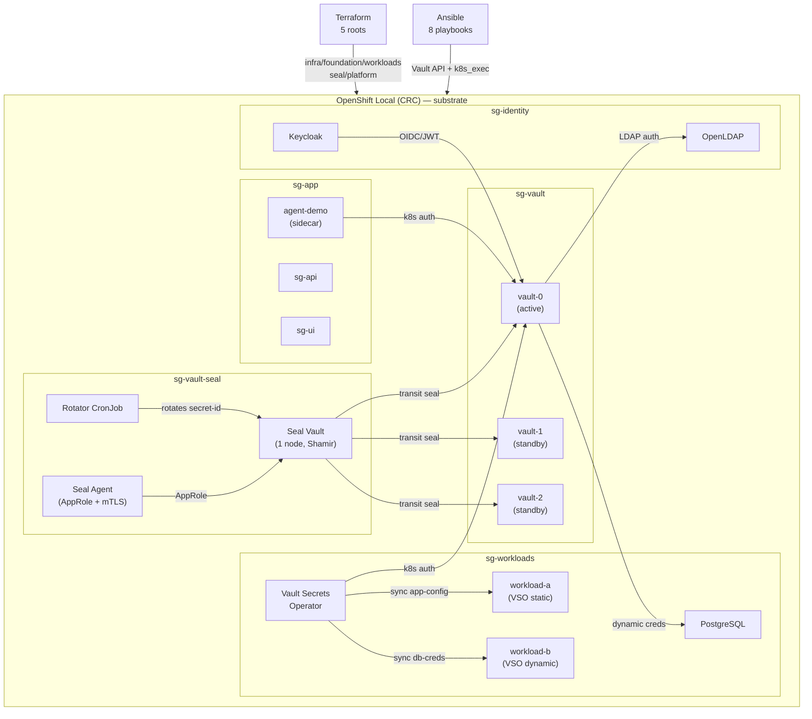

# Architecture

Shift Gear runs on a single OpenShift Local (CRC) instance. Three concerns, three tools:

- **Terraform** — everything with an API and a lifecycle: Kubernetes objects, Helm releases,
  Vault structure (namespaces, mounts, policies, token roles, audit devices).
- **Ansible** — everything with an order and a moment: init, unseal, credentials, people,
  seeds, proofs. Never creates infrastructure; configures it after Terraform declares it.
- **Vault Secrets Operator** — runtime secret delivery to workload pods. No Vault token in
  any pod.

---

## Namespaces

| Namespace | Owner | Contents |
|---|---|---|
| `sg-vault-seal` | tf workloads | Seal Vault (1 node, Shamir), seal agent, rotator |
| `sg-vault` | tf workloads | Vault Enterprise ×3 (Raft HA), transit-sealed |
| `sg-identity` | tf workloads | OpenLDAP, Keycloak |
| `sg-workloads` | tf workloads | workload-a (VSO static), workload-b (VSO dynamic), PostgreSQL |
| `sg-app` | tf foundation | agent-demo (Vault Agent sidecar), Shift Gear API + UI |
| `openshift-operators` | tf foundation | Vault Secrets Operator (CSV) |

All namespaces are created by `terraform/foundation/`. The VSO Subscription is in
`openshift-operators`; the operator is cluster-scoped.

---

## Seal chain

The cluster never holds an unseal token. The design:

```
Seal Vault (sg-vault-seal)
  ├── Transit mount:  autounseal key
  ├── AppRole role:   sg-seal-autounseal
  └── Policy:         autounseal.hcl
           │
           ▼ (transit encrypt/decrypt)
    Vault cluster ×3 (sg-vault)
      Helm values: seal { type=transit, address=vault-seal-internal.sg-vault-seal.svc }
           │
           ▼ (auto-unseals on pod restart)
      Seal agent (Deployment: sg-vault-seal/seal-agent)
        auth: AppRole (role-id + secret-id from Secrets)
        listener: mTLS on port 8200 (client + server TLS)
        does NOT hold a Vault unseal token
        rotator CronJob: rotates AppRole secret-id every 24 h
```

**No seal token on the cluster.** The cluster Vault pods unseal themselves via the transit
seal stanza in their Helm values. The seal agent's AppRole authenticates to the seal Vault — not
to the cluster Vault.

---

## Vault HA topology

Three `vault-N` pods form an integrated Raft cluster:

```
vault-0  (active leader — elected by Raft)
vault-1  (standby voter)
vault-2  (standby voter)
```

All three are in `sg-vault`. Traffic reaches them through a single Route
(`vault.apps-crc.testing`, TLS passthrough) that balances across the `active=true` pod via a
Kubernetes `Service` in `ClusterIP` mode — the load balancer routes to the active node directly
(Vault redirects standbys).

The enterprise namespace is `shift-gear`. All mounts, policies, auth methods, and secrets live
there. Every Ansible task and every Terraform provider block sets `X-Vault-Namespace: shift-gear`.

---

## Ownership table

| Resource | Created by | Configured by | Delivered by |
|---|---|---|---|
| Kubernetes namespaces | tf foundation | — | — |
| Routes, Services | tf foundation/workloads | — | — |
| Helm releases (Vault, VSO) | tf workloads | — | — |
| OpenLDAP, Keycloak Deployments | tf workloads | ansible identity | — |
| Vault init + unseal keys | — | ansible seal-init, bootstrap | — |
| Bootstrap tokens | — | ansible seal-init, bootstrap | — |
| Vault mounts + policies | tf seal, platform | — | — |
| Auth methods | — | ansible configure, identity | — |
| KV secrets, DB credentials | — | ansible configure | — |
| User accounts + groups | — | ansible identity | — |
| VSO resources (CRDs) | tf workloads | — | vso |
| App Secrets (runtime) | — | — | vso |
| Vault Agent sidecar secrets | — | — | vault-agent |

---

## Tool boundary (Vault-enforced)

Four bootstrap tokens, each with a distinct capability set:

| Token | May | May not |
|---|---|---|
| `sg-tf-seal` | Create transit mount, autounseal key, AppRole roles | Mint secret-id, write policy |
| `sg-ansible-seal` | Mint secret-ids, read role-ids | Create mount, write policy |
| `sg-tf-platform` | Create mounts, write policies, token roles, audit | Enable auth methods, write KV data |
| `sg-ansible-platform` | Enable auth methods, write KV data, mint DB credentials | Create mount, write policy |

Verified by `make boundary` (19 `sys/capabilities-self` checks). See
[security model](security-model.md) for the full boundary rationale.

---

## VSO flow

```
VaultConnection (sg-workloads)
  └── address: https://vault.apps-crc.testing
      cacert: CA ConfigMap

VaultAuth (sg-workloads)
  └── method: kubernetes
      serviceAccount: vso-workloads
      policy: sg-vso (in shift-gear namespace)

VaultStaticSecret (sg-workloads)
  └── mount: kv
      path: shift-gear/config/app-config
      destination Secret: app-config

VaultDynamicSecret (sg-workloads)
  └── mount: database
      path: creds/demo-reader
      destination Secret: db-creds
      renewalPercent: 80

Secret: app-config (sg-workloads)
  └── mounted read-only into workload-a pod

Secret: db-creds (sg-workloads)
  └── mounted read-only into workload-b pod
```

No Vault token in any pod. The VSO operator authenticates with Kubernetes auth using the
projected service account token of the `vso-workloads` SA.

---

## Agent demo

`sg-app/agent-demo` pod has two containers beyond the application:

1. **`vault-agent-init`** (init container) — writes `demo-secret` to `/vault/secrets/` before the
   app starts.
2. **`vault-agent`** (sidecar) — keeps the file current; rotates when the lease expires.

Auth method: Kubernetes (`sg-agent-demo` role, `sg-app` namespace, `agent-demo-sa` SA).
Policy: `sg-agent-demo` (read `kv/data/shift-gear/demo/agent-demo`).

The application container reads `/vault/secrets/demo-secret` directly — no Vault API call,
no token, no environment variable.

---

## Audit

Two audit devices are enabled on the cluster Vault (namespace `shift-gear`):

| Device | Path | Type | Notes |
|---|---|---|---|
| `file/` | `/vault/audit/audit.log` | file | Written to a PVC mounted in each Vault pod |
| `socket/` | `127.0.0.1:9090` | socket (TCP) | Ansible configure phase enables this |

---

## NetworkPolicies

Each namespace has a `default-deny` ingress policy. Named allow policies open only the required
paths:

- `sg-vault-seal`: allow from `sg-vault` pods (transit seal) and from the seal agent.
- `sg-vault`: allow from Routes (ingress controller), from `sg-workloads` (VSO), from
  `sg-app` (agent-demo), from `sg-vault-seal` (seal agent health probes).
- `sg-workloads`: allow from Routes (workload Deployments serve no inbound traffic; deny-all is
  fine).
- `sg-identity`: allow from `sg-vault` (LDAP auth).
- `sg-app`: allow from Routes.

---

## System diagram



See also: [`docs/frontend/DESIGN.md`](frontend/DESIGN.md) for the console UI design.
